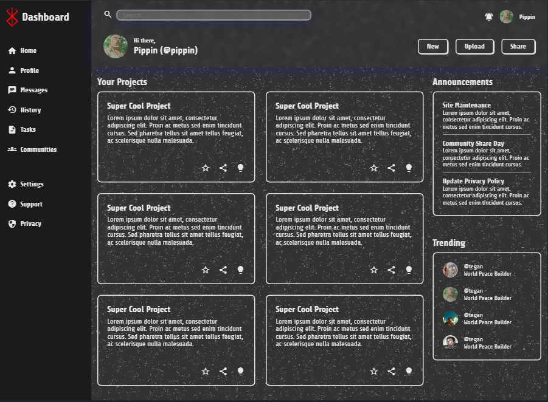

# odin-dashboard

Admin Dashboard Project

This project is an implementation of the Admin Dashboard from The Odin Project. It was designed using CSS Grid and structured to improve my understanding of layout techniques in web development.

## Project Preview

## Final Implementation

## Design Inspiration

This project was inspired by the UI design of video games and the dark aesthetic of the manga/anime Berserk. The inspiration for the styling was taken from a Behance project and adjusted to fit a dashboard interface.

## Behance Inspiration

**Poster Berserk** by **[Delfi Molina](https://www.behance.net/gallery/218045821/Poster-Berserk)**

_(Click the link to view the original project.)_

## Features

- CSS Grid Layout for organizing sections
- Custom Styling with a dark UI theme
- Hover Animations for interactive elements
- Material Icons for dashboard controls
- Grid-based layout with automatic column adjustments, though not fully responsive for all screen sizes

## Technologies Used

- HTML
- CSS (Grid, Flexbox, Custom Variables)

## Notes

Although I do not have a design background, I aimed to create a video game UI-inspired look based on feedback I received. This project was a great way to explore layout structures and experiment with custom design elements.

## Future Improvements

- Adding more animations for interactivity
- Refining the UI for better readability and contrast
- Improving accessibility features

If you have any suggestions or feedback, feel free to share!
